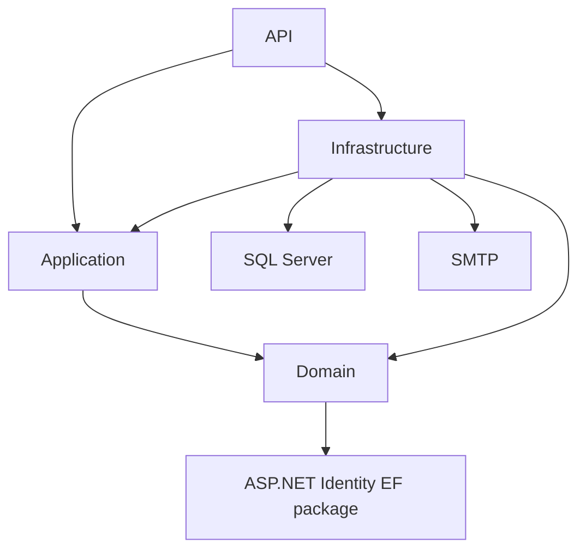

# AgileFlow Backend Technical Report

> Evidence basis: submitted AgileFlow repository snapshot
> Backend solution: `backend/AgileFlow.slnx`
> Reviewed: 16 July 2026

## Executive Summary

AgileFlow's backend implements the project's core workspace-based planning and delivery workflow using Onion Architecture with the Repository Pattern. The API coordinates authentication, workspace authorization, projects, sprints, boards, tasks, dependencies, review, activity history, dashboards, email attempts, and database migration. This report documents both the implemented behavior and the engineering improvements required for stronger transactional consistency, security, test coverage, and production readiness.

## Contents

1. [Verified Backend Inventory](#1-verified-backend-inventory)
2. [Onion Architecture](#2-onion-architecture)
3. [Startup and Runtime](#3-startup-and-runtime)
4. [Authentication and Account](#4-authentication-and-account)
5. [Authorization](#5-authorization)
6. [Domain and Persistence](#6-domain-and-persistence)
7. [Workspace, Project, Sprint, Board, and Dashboard](#7-workspace-project-sprint-board-and-dashboard)
8. [Task Workflow](#8-task-workflow)
9. [Email and Background Work](#9-email-and-background-work)
10. [API Reference](#10-api-reference)
11. [Error Behavior](#11-error-behavior)
12. [Security Review](#12-security-review)
13. [Testing and CI](#13-testing-and-ci)
14. [Engineering Improvement Plan](#14-engineering-improvement-plan)
15. [Technical Discussion Questions](#15-technical-discussion-questions)

## 1. Verified Backend Inventory

| Item | Count |
| --- | ---: |
| API controllers | 8 |
| HTTP actions | 52 |
| Domain entities | 16 |
| Domain enums | 10 |
| Infrastructure services | 13 |
| Repositories | 8 |
| EF configurations | 16 |
| EF migrations | 7 |
| Postman requests | 105 |
| Static Postman `pm.test(...)` definitions | 157 |

The solution file includes:

- `API/API.csproj`
- `Application/Application.csproj`
- `Domain/Domain.csproj`
- `Infrastructure/Infrastructure.csproj`

`backend/Tests/Tests.csproj` is not included in the solution.

## 2. Onion Architecture

AgileFlow uses Onion Architecture with the Repository Pattern.

### 2.1 Project Dependencies



Verified project references:

- API references Application and Infrastructure.
- Application references Domain.
- Infrastructure references Application and Domain.
- Domain references `Microsoft.AspNetCore.Identity.EntityFrameworkCore`.

### 2.2 Project Responsibilities

| Project | Current responsibility |
| --- | --- |
| Domain | Entities, enums, base entity, state-changing methods |
| Application | DTOs, service/repository interfaces, mapping profiles, application exception |
| Infrastructure | EF Core, migrations, repositories, services, JWT creation, SMTP, reminder worker |
| API | Controllers, middleware, startup, DI, authentication, Swagger, static files |

### 2.3 Current Implementation Notes

- `AppUser` is in Domain and inherits `IdentityUser`.
- Business use-case services are implemented in Infrastructure.
- API directly references Infrastructure.
- Repositories execute `SaveChangesAsync` themselves.
- One use case can perform several independent commits.

These points describe the implementation without changing the project architecture name.

## 3. Startup and Runtime

### 3.1 Startup Sequence

`Program.cs`:

1. Creates the API static-file directories.
2. Registers controllers and Swagger.
3. Registers SQL Server `AgileFlowDbContext`.
4. Configures ASP.NET Identity.
5. Configures JWT Bearer authentication.
6. Registers two role policies.
7. Registers AutoMapper.
8. Registers repositories and services.
9. Registers the due-date hosted service.
10. Configures Development CORS.
11. Builds the application.
12. Adds exception middleware.
13. calls `Database.Migrate()`.
14. Enables Swagger and CORS in Development.
15. Enables static files.
16. Enables HTTPS redirection.
17. Enables authentication and authorization.
18. Maps controllers.

### 3.2 Database Migration

The API calls:

```csharp
dbContext.Database.Migrate();
```

Consequences:

- missing database is created by the provider when possible;
- pending migrations are applied at startup;
- startup fails when SQL Server or a migration fails;
- multiple deployed instances could compete to migrate.

### 3.3 Middleware Order

Relevant order:

```text
Exception middleware
Swagger/CORS in Development
Static files
HTTPS redirection
Authentication
Authorization
Controllers
```

Because static files run before HTTPS redirection, a matching profile-image request can be served before redirection.

### 3.4 Development Configuration

The checked-in launch profile defines:

- `ConnectionStrings:DefaultConnection`
- `Jwt:Issuer`
- `Jwt:Audience`
- `Jwt:Key`
- `Jwt:ExpiryMinutes`
- `Email:Smtp:Host`
- `Email:Smtp:Port`
- `Email:Smtp:UseSsl`
- `Email:Smtp:Username`
- `Email:Smtp:Password`
- `Email:Smtp:FromEmail`
- `Email:Smtp:FromName`
- `Email:Smtp:FrontendBaseUrl`

Default HTTP API URL: `http://localhost:6358`.

Swagger is hosted at the API root in Development. Its current label is `SolKey API v1`.

## 4. Authentication and Account

### 4.1 Identity Settings

Configured password requirements:

- minimum length 8;
- digit;
- lowercase;
- uppercase;
- non-alphanumeric character.

Configured account settings:

- unique email;
- maximum five failed attempts;
- 15-minute lockout.

The custom login service uses `CheckPasswordAsync` and does not execute Identity's failed-attempt/lockout workflow. The lockout values are therefore configured but not enforced by this login path.

### 4.2 Registration

Registration:

1. checks for an existing email;
2. creates `AppUser`;
3. sets username to email;
4. calls `UserManager.CreateAsync`;
5. generates an email-confirmation token;
6. attempts SMTP delivery;
7. attempts an email audit write;
8. returns 201 without tokens.

Email failure does not undo account creation.

Auth request records have limited explicit validation annotations. Email format and length rules are not comprehensively defined at the DTO boundary.

### 4.3 Confirmation

Normal confirmation route:

```text
GET /api/auth/confirm-email?userId=...&token=...
```

Behavior:

- missing query values: 400;
- unknown user id: 200, `Confirmed = false`, empty email;
- already confirmed user: 200, `Confirmed = true`;
- existing user with invalid token: 200, `Confirmed = false`, account email;
- valid token: Identity confirms the account.

The response is not fully enumeration-safe because unknown and existing user ids return different email fields.

Resend route always returns 204 and does not reveal whether an email exists.

Development also exposes:

```text
POST /api/auth/dev/confirm-email
```

It is hidden from Swagger and returns 404 outside Development.

### 4.4 Login

Login:

1. finds the user by email;
2. checks password;
3. rejects unconfirmed email;
4. rejects soft-deleted account;
5. calculates the highest role across non-deleted membership rows;
6. creates an access/refresh pair.

The token role is not the role for a specific target workspace.

### 4.5 JWT

Access token:

- HMAC SHA-256;
- issuer validation;
- audience validation;
- lifetime validation;
- signing-key validation;
- 30-second clock skew;
- configured/default 60-minute expiry.

Claims:

- `sub`
- `email`
- `jti`
- `ClaimTypes.NameIdentifier`
- `ClaimTypes.Role`
- `role`

### 4.6 Refresh Tokens

Refresh tokens:

- 64 random bytes encoded as Base64;
- persisted in SQL Server;
- unique index on token;
- seven-day hard-coded lifetime;
- revoked during successful refresh;
- replaced with a new access/refresh pair.

Current limitations:

- token is stored in plaintext;
- refresh validation disables audience validation;
- no token family or replay-chain handling;
- no device/session metadata;
- no cleanup job for expired/revoked rows.

### 4.7 Logout

Logout finds the supplied non-revoked refresh token and marks it revoked.

The service does not receive the authenticated caller id. A caller who knows another user's refresh token can revoke it.

### 4.8 Account Profile

Authenticated users can:

- read profile;
- update first name;
- update last name;
- update/clear phone;
- update/clear date of birth;
- update/clear GitHub username;
- update/clear the raw profile-picture value;
- upload a picture file.

Upload checks:

- maximum 5 MB;
- MIME begins with `image/`;
- extension is JPG, JPEG, PNG, WEBP, or GIF.

Limitations:

- MIME and extension are client-controlled;
- file signature is not verified;
- image is not decoded/re-encoded;
- old files are not deleted;
- the file is written before the account update is confirmed;
- storage is local disk;
- files are served publicly by static-file middleware.

### 4.9 Assigned External Authentication Piece

Moataz Hamdy (`M3tazz`) is responsible for the team's Google/GitHub third-party authentication piece.

The submitted repository snapshot contains no merged OAuth controller, provider configuration, external-login service, frontend OAuth action, or provider callback workflow. The assignment is therefore recorded as planned/unmerged work rather than implemented backend functionality.

## 5. Authorization

### 5.1 Workspace Roles

```text
Developer = 0
TeamLead  = 1
Admin     = 2
```

Roles are stored in `UserWorkspace`, not assigned through Identity roles.

### 5.2 Central Authorization Service

`WorkspaceAuthorizationService`:

- checks active membership;
- checks allowed workspace roles;
- resolves project to workspace;
- resolves sprint to workspace;
- resolves task to workspace;
- checks task assignment.

Failed permission checks throw `UnauthorizedAccessException`, mapped to 403.

### 5.3 Permission Matrix

| Capability | Required access |
| --- | --- |
| Register/login/confirm/resend/refresh | Public |
| Logout/account | Authenticated |
| Create/list workspaces | Authenticated |
| Read workspace | Member |
| Update/delete workspace | Admin or TeamLead |
| Add/restore member | Admin |
| Change member role | Admin |
| Remove member | Admin |
| Read member detail | Member |
| Read projects/sprints/progress | Member |
| Manage projects/sprints | Admin or TeamLead |
| Read board | Member; Developer response filtered |
| Manage columns | Admin or TeamLead |
| Read task list/detail/activity | Member |
| Create/delete/move/status/assign task | Admin or TeamLead |
| Edit task fields | Admin, TeamLead, or active assignee |
| Submit task | Active assignee |
| Review task | Admin or TeamLead |
| Add/remove dependency | Admin or TeamLead |
| Dashboard | Authenticated, scoped by membership queries |

### 5.4 Membership Safeguards

- creator becomes Admin;
- creator cannot be removed;
- creator cannot be demoted;
- caller cannot remove themselves;
- final Admin/TeamLead cannot be removed or demoted.

Creator identity is inferred from earliest `JoinedAt`; it is not stored explicitly.

Any workspace member can call member-detail and receive fields including email, phone number, date of birth, GitHub username, and role.

## 6. Domain and Persistence

### 6.1 Entities

| Entity | Purpose |
| --- | --- |
| `AppUser` | Identity and profile |
| `RefreshToken` | Session refresh credential |
| `Workspace` | Collaboration container |
| `UserWorkspace` | Membership and role |
| `Project` | Workspace project |
| `Board` | Project board |
| `BoardColumn` | Ordered column |
| `Sprint` | Project sprint |
| `ProjectTask` | Task state |
| `UserTask` | Assignment |
| `TaskDependent` | Dependency edge |
| `Commit` | Submitted commit evidence |
| `Comment` | Review comment |
| `TaskActivityLog` | Task audit |
| `Notification` | In-app notification model only |
| `EmailNotificationLog` | Email audit/deduplication |

### 6.2 Enums

| Enum | Values |
| --- | --- |
| `UserRole` | Developer, TeamLead, Admin |
| `ProjectStatus` | InProgress, Completed, OnHold, Cancelled |
| `SprintStatus` | Planning, Active, Completed, Cancelled |
| `ProjectTaskStatus` | Todo, InProgress, Done, Cancelled |
| `ProjectTaskPriority` | Low, Medium, High, Critical |
| `ProjectTaskApprovalStatus` | Pending, Approved, Rejected |
| `CommitStatus` | Pending, Merged, Rejected |
| `NotificationType` | Info, Warning, Error |
| `EmailEventType` | EmailVerification, WorkspaceInvite, TaskAssigned, TaskSubmittedForReview, TaskReviewApproved, TaskReviewRejected, DueDateReminder |
| `EmailSendStatus` | Sent, Failed |

No global JSON string-enum converter is configured. Request enums generally use numbers.

Several request enums are not checked with `Enum.IsDefined`, and the database does not use enum check constraints. Undefined numeric roles/statuses/priorities can be accepted.

### 6.3 Keys and Indexes

- one-to-one Board/Project relationship;
- composite `UserWorkspace` key;
- composite `UserTask` key;
- composite `TaskDependent` key;
- unique refresh-token index;
- unique email deduplication-key index;
- email recipient/event index;
- email created-time index.

Application-only uniqueness or limits:

- workspace name among the caller's memberships;
- project name in a workspace;
- one active sprint per project;
- intended four-column maximum.

These checks can race.

### 6.4 Soft Deletion

Global filters hide many deleted rows.

Workspace/project/task services generally call entity `Delete()` instead of physical delete.

Soft deletion does not execute EF cascade delete. Deleting a workspace does not mark every project, sprint, task, or membership deleted. Some child-resource paths can therefore remain accessible.

### 6.5 Save Boundaries

Repositories save individually.

Examples:

- workspace and creator membership use separate saves;
- project, board, and default columns use separate saves;
- task and each assignment use separate saves;
- submit updates task, commit, and logs separately;
- review updates task, commit, comment, and logs separately.

A late failure can leave partial state.

## 7. Workspace, Project, Sprint, Board, and Dashboard

### 7.1 Workspace

Create:

- any authenticated user;
- duplicate name checked in caller's workspace set;
- creator membership is Admin.

Member management:

- target must already be registered;
- Admin only;
- removed membership can be restored;
- invite email is attempted.

Delete:

- Admin or TeamLead;
- soft-deletes only the workspace row.

### 7.2 Project

Create checks:

- workspace exists;
- caller is Admin/TeamLead;
- end date after start date;
- name unique inside workspace.

Effects:

- project saved;
- board saved;
- To Do, In Progress, and Done columns saved.

Project status has no lifecycle rules. Any bound enum value can be used at create/update.

Update blocks an end date before:

- project start;
- an existing sprint end;
- an existing task due date.

### 7.3 Sprint

Create:

- starts Planning;
- dates remain inside project.

Update:

- start date remains fixed;
- name, goal, end date can change;
- end cannot precede task due dates.

Start:

- rejects Completed and Cancelled;
- checks for another Active sprint;
- does not reject the same sprint when already Active.

Complete:

- requires Active;
- requires every loaded task Done and Approved;
- allows an empty Active sprint.

Progress:

- Done-and-Approved count divided by total;
- rounded to two decimals;
- empty sprint returns 0%.

There is no sprint cancel endpoint.

### 7.4 Board

Managers see all sprint tasks on the board.

Developer response includes tasks with these reasons:

- `AssignedToYou`
- `DependsOnYourTask`
- `MandatoryForYourTask`

This filtering is only applied to board response construction. Task list/detail/activity and dashboard reads are broader.

Column behavior:

- max check uses `count == 4`;
- no database constraint;
- no unique-name rule;
- deletion blocked when active tasks exist;
- reorder does not require the exact unique set of columns;
- board retrieval does not validate that `sprintId` belongs to `projectId`.

### 7.5 Dashboard

Summary returns:

- caller workspaces;
- projects;
- sprints;
- all tasks in those workspaces;
- separate assigned-task subset.

`my-tasks` returns assigned tasks with workspace, project, sprint, and workspace-member context.

No pagination or `AsNoTracking()` is used.

## 8. Task Workflow

### 8.1 State Fields

Task status:

- Todo
- InProgress
- Done
- Cancelled

Approval:

- null
- Pending
- Approved
- Rejected

Commit:

- Pending
- Merged
- Rejected

### 8.2 Column-to-Status Mapping

Normalized column name:

- `Done` -> Done
- `InProgress` or `Doing` -> InProgress
- `Cancelled` -> Cancelled
- other -> Todo

Renaming a column can change task status behavior.

### 8.3 Create

Manager-only.

Checks:

- sprint exists;
- column exists;
- column belongs to sprint project;
- selected column is not Done-mapped;
- due date is provided;
- due date is inside sprint/project;
- assignees are workspace members.

`CreateTaskRequest.Status` is ignored. Status comes from the column name.

Assignments created with the task do not trigger assignment email.

### 8.4 Edit

Manager or active assignee.

Editable:

- title;
- description;
- priority;
- due date.

The request must repeat the current status. Status changes through this endpoint return 409.

### 8.5 Direct Status

Manager-only.

- Done requires Approved.
- Pending blocks direct status changes.
- leaving Done clears Approved.
- activity log is attempted after task save.

Undefined numeric status values are not explicitly rejected.

### 8.6 Move

Manager-only.

- target column must belong to task project;
- status derives from column;
- Done column requires task already Done and Approved;
- Done movement rechecks dependencies;
- non-Done movement clears Pending or Approved.

Current inconsistency:

- moving a Pending task can clear approval;
- the latest Pending commit is not updated;
- review state and commit state diverge.

Approval changes status to Done but does not move `ColumnId`. Logical status and visual column can differ.

### 8.7 Assignment

Manager-only.

- assignee must be a workspace member;
- removed assignment can be restored;
- duplicate active assignment is a no-op;
- dedicated assign endpoint still attempts assignment email.

Assignment changes are not recorded in task activity logs.

### 8.8 Submit

Active-assignee only.

Checks:

- commit hash non-empty;
- dependencies Done and Approved;
- task not already Pending.

Effects:

- ApprovalStatus -> Pending;
- Commit row -> Pending;
- branch and URL -> empty;
- activity logs attempted;
- reviewer emails attempted.

No check prevents submission of an already Done/Approved task.

### 8.9 Review

Manager-only.

Checks:

- decision is Approved or Rejected;
- comment non-empty;
- task Pending;
- latest commit exists;
- approval rechecks dependencies.

Approve:

- approval Approved;
- status Done;
- commit Merged.

Reject:

- approval Rejected;
- commit Rejected;
- Done status becomes InProgress.

Review comment permits 2,000 characters. Activity-log values permit 500 characters. A long comment can save earlier review data and then fail while saving the review-comment activity log.

### 8.10 Dependencies

For `(TaskId, DependedTaskId)`, TaskId depends on DependedTaskId.

Add rejects:

- self;
- duplicate;
- other project;
- source Done;
- source Pending;
- directed cycle.

Completion gate is checked during:

- submit;
- approval;
- movement to Done.

If a dependency is later moved backward, completed dependent tasks are not reopened.

Cycle detection recursively queries each visited task's dependency ids.

### 8.11 Activity Logs

Recorded fields include:

- Title
- Description
- Priority
- DueDate
- Status
- ColumnId
- ApprovalStatus
- CommitSubmitted
- ReviewComment
- DependencyAdded
- DependencyRemoved

Not logged:

- assignment/unassignment;
- task creation/deletion.

## 9. Email and Background Work

### 9.1 SMTP

MailKit sender:

- creates HTML and plain-text bodies;
- supports optional authentication;
- uses SSL-on-connect or StartTLS-when-available;
- logs subject and recipient.

HTML interpolates names, titles, commit hash, and comments without explicit HTML encoding.

### 9.2 Email Events

- EmailVerification
- WorkspaceInvite
- TaskAssigned
- TaskSubmittedForReview
- TaskReviewApproved
- TaskReviewRejected
- DueDateReminder

### 9.3 Failure Handling

Workflow email:

1. attempts SMTP;
2. creates success/failure log;
3. attempts log insert;
4. swallows log failure.

The business request may succeed without email or durable audit evidence.

### 9.4 Deduplication

Email logs use a unique deduplication key.

Due reminders check for the key before send. Other event paths send before the unique log insert.

Multiple instances can send duplicates before one log insert loses the race.

### 9.5 Reminder Worker

The worker:

- runs immediately at startup;
- waits one hour after each run;
- scans assignments due within 24 hours;
- excludes Done tasks;
- ignores the normal assignment query filter and checks `IsDeleted` itself.

It does not explicitly exclude:

- Cancelled tasks;
- deleted/inactive workspace;
- deleted/inactive project;
- deleted/inactive sprint.

Failed logged reminders are not retried for the same key.

## 10. API Reference

### 10.1 Authentication

| Method | Route | Access |
| --- | --- | --- |
| POST | `/api/auth/register` | Public |
| POST | `/api/auth/login` | Public |
| GET | `/api/auth/confirm-email` | Public |
| POST | `/api/auth/resend-confirmation` | Public |
| POST | `/api/auth/dev/confirm-email` | Development public |
| POST | `/api/auth/refresh` | Public |
| POST | `/api/auth/logout` | Authenticated |

### 10.2 Account

| Method | Route |
| --- | --- |
| GET | `/api/account/me` |
| PUT | `/api/account/me` |
| POST | `/api/account/me/profile-picture` |

### 10.3 Workspace

| Method | Route |
| --- | --- |
| GET | `/api/Workspaces` |
| GET | `/api/Workspaces/{id}` |
| POST | `/api/Workspaces` |
| PUT | `/api/Workspaces/{id}` |
| DELETE | `/api/Workspaces/{id}` |
| POST | `/api/Workspaces/{workspaceId}/members` |
| PUT | `/api/Workspaces/{workspaceId}/members/{memberUserId}/role` |
| DELETE | `/api/Workspaces/{workspaceId}/members/{memberUserId}` |
| GET | `/api/Workspaces/{workspaceId}/members/{memberUserId}` |

### 10.4 Project

| Method | Route |
| --- | --- |
| GET | `/api/Projects/workspace/{workspaceId}` |
| GET | `/api/Projects/{id}` |
| POST | `/api/Projects` |
| PUT | `/api/Projects/{id}` |
| DELETE | `/api/Projects/{id}` |

### 10.5 Sprint

| Method | Route |
| --- | --- |
| GET | `/api/projects/{projectId}/sprints` |
| POST | `/api/projects/{projectId}/sprints` |
| GET | `/api/sprints/{id}` |
| PUT | `/api/sprints/{id}` |
| PUT | `/api/sprints/{id}/start` |
| PUT | `/api/sprints/{id}/complete` |
| GET | `/api/sprints/{id}/progress` |

### 10.6 Board

| Method | Route |
| --- | --- |
| GET | `/api/projects/{projectId}/board?sprintId={id}` |
| POST | `/api/projects/{projectId}/board/columns` |
| PUT | `/api/columns/{columnId}` |
| DELETE | `/api/columns/{columnId}` |
| PUT | `/api/projects/{projectId}/board/columns/order` |

### 10.7 Task

| Method | Route |
| --- | --- |
| GET | `/api/sprints/{sprintId}/tasks` |
| POST | `/api/sprints/{sprintId}/tasks` |
| GET | `/api/tasks/{id}` |
| PUT | `/api/tasks/{id}` |
| PUT | `/api/tasks/{id}/status` |
| POST | `/api/tasks/{id}/submit` |
| PUT | `/api/tasks/{id}/review` |
| PUT | `/api/tasks/{id}/move` |
| POST | `/api/tasks/{id}/assignees` |
| DELETE | `/api/tasks/{id}/assignees/{assigneeUserId}` |
| DELETE | `/api/tasks/{id}` |
| POST | `/api/tasks/{id}/dependencies/{dependencyTaskId}` |
| DELETE | `/api/tasks/{id}/dependencies/{dependencyTaskId}` |
| GET | `/api/tasks/{id}/activity-logs` |

### 10.8 Dashboard

| Method | Route |
| --- | --- |
| GET | `/api/dashboard/summary` |
| GET | `/api/dashboard/my-tasks` |

## 11. Error Behavior

| Exception | Status |
| --- | ---: |
| `KeyNotFoundException` | 404 |
| `EmailNotVerifiedException` | 403 |
| `UnauthorizedAccessException` | 403 |
| `ArgumentException` | 400 |
| `InvalidOperationException` | 409 |
| `SecurityTokenException` | 401 |
| Other | 500 |

Important consequences:

- invalid login credentials return 403;
- invalid refresh requests normally return 403 because token errors are wrapped;
- model validation uses ASP.NET problem details;
- middleware errors use `{ message }`;
- email-not-confirmed adds `requiresEmailConfirmation` and `email`.

## 12. Security Review

### 12.1 Implemented Controls

- Identity password hashing;
- password complexity;
- unique email;
- email-confirmation gate;
- signed JWT;
- issuer/audience/lifetime validation for normal requests;
- random refresh tokens;
- refresh rotation;
- service-level membership and role checks;
- task dependency and state checks;
- upload size/MIME/extension checks;
- generic unexpected 500 message;
- resend-confirmation non-enumeration response;
- Development-only dev-confirm endpoint.

### 12.2 Current Improvement Areas

- lockout workflow not used;
- no rate limiting;
- plaintext refresh tokens;
- refresh audience not validated;
- logout token not caller-bound;
- token role is cross-workspace;
- confirmation response can reveal user existence;
- member-detail response exposes private profile fields to any member;
- HTML email interpolation is not encoded;
- image signatures are not validated;
- no antivirus/image processing;
- static files precede HTTPS redirect;
- no MFA;
- no password reset/change endpoints;
- no authentication-event audit;
- no revoke-all-sessions endpoint;
- no consistent task-read authorization policy.

## 13. Testing and CI

### 13.1 Current Assets

#### xUnit

`backend/Tests` contains:

```csharp
Assert.True(true);
```

It has no project references to the application and tests no business behavior.

It is not part of `backend/AgileFlow.slnx`.

#### Postman/Newman

- 105 requests;
- 157 static test definitions;
- folders for health/Swagger, auth, account, workspace, projects, sprints, board, tasks, dependencies/activity, business-day journey, and negative/security cases.

The collection demonstrates intended coverage; a passing live run still requires the API and database services.

#### Playwright

Two scenarios:

- registration displays verification state;
- profile edit persists.

Profile edit is skipped unless confirmed credentials are configured.

#### GitHub Actions

CI:

- runs on pushes and pull requests to `main`;
- uses .NET 8 on Ubuntu;
- restores the four-project solution;
- builds Release.

CI does not:

- run tests;
- build the separate Tests project;
- run SQL Server or migrations;
- run Newman;
- run frontend lint/build;
- run Playwright;
- deploy.

### 13.2 Verification Snapshot

Executed during documentation work:

- backend solution build: passed, 0 errors;
- warning: `NU1902` for MailKit `4.7.1.1`;
- separate xUnit project: one placeholder test passed;
- frontend lint: passed;
- frontend build: passed with a large-bundle warning.

Not executed:

- Newman;
- Playwright.

## 14. Engineering Improvement Plan

1. Add `backend/Tests` to the solution and CI.
2. Add real service and SQL Server integration tests.
3. Use one transaction per business use case.
4. Fix soft-delete parent/child visibility.
5. Enforce one active sprint and board-column limits safely.
6. Replace column-name status mapping.
7. Block or define resubmission of completed tasks.
8. Block movement while review is Pending or resolve the commit state.
9. Propagate dependency regression.
10. Align activity-log length with accepted input.
11. Validate enum values.
12. Fix lockout, refresh audience, token hashing, and logout ownership.
13. Restrict member-detail fields.
14. Add durable email outbox/retry.
15. Exclude Cancelled and inactive-parent tasks from reminders.
16. Move static files behind HTTPS enforcement.
17. Rename Swagger from `SolKey API v1`.

## 15. Technical Discussion Questions

### What architecture does AgileFlow use?

Onion Architecture with the Repository Pattern. Current implementation notes are that Domain depends on Identity, services live in Infrastructure, API references Infrastructure, and repositories save independently.

### Where are the main business rules?

Infrastructure services such as `WorkspaceService`, `ProjectService`, `SprintService`, `BoardService`, and `TaskService`.

### Are Admin and TeamLead identical?

They are equal for workspace update/delete and delivery management. Membership administration is Admin-only.

### Can a Developer move an assigned task?

No. Move and direct status endpoints require Admin or TeamLead.

### Can a manager submit a task?

Only when the manager is also an active assignee.

### Is Pending review a task status?

No. It is `ApprovalStatus = Pending`.

### Does approval move the card?

No. Approval changes task status to Done but does not change `ColumnId`.

### Is the commit checked against GitHub?

No. Only the supplied hash is stored. Branch and URL are empty.

### Who is assigned the Google/GitHub OAuth piece?

Moataz Hamdy (`M3tazz`). This is his team-assigned responsibility, and the submitted repository snapshot records it as planned/unmerged.

### Can two sprints become Active?

Sequential requests are checked, but there is no database constraint or concurrency-safe transaction.

### Can an empty sprint complete?

Yes, when it is Active.

### Does the board's Developer filter secure every task read?

No. It only filters the board response.

### Are email sends exactly once?

No. Deduplication logging occurs after SMTP for most events, and multiple instances can race.

### Are backend tests meaningful?

Not yet. The xUnit project currently has one placeholder test and is outside the solution.

### Is the current API production-ready?

No. Authentication hardening, transactions, concurrency, authorization consistency, durable email, file storage, observability, tests, and deployment work remain.

## Final Statement

The submitted snapshot implements the principal AgileFlow backend workflow using Onion Architecture with repository and service abstractions. Service-level coordination covers workspace roles, project/sprint/task dates, task review, dependencies, activity, authentication tokens, and email attempts. The documented improvement plan focuses on automated testing, transactional consistency, soft-delete visibility, authentication hardening, and task-state edge cases.
