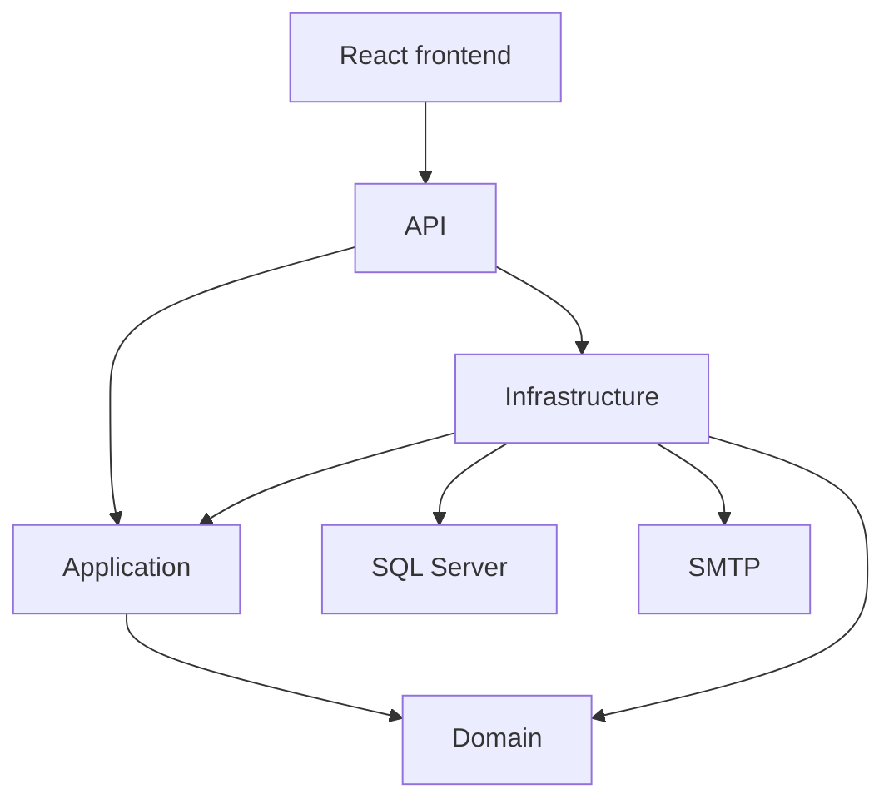
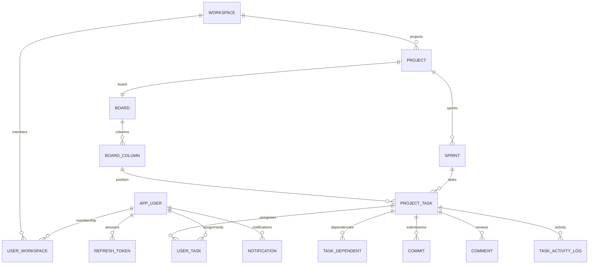
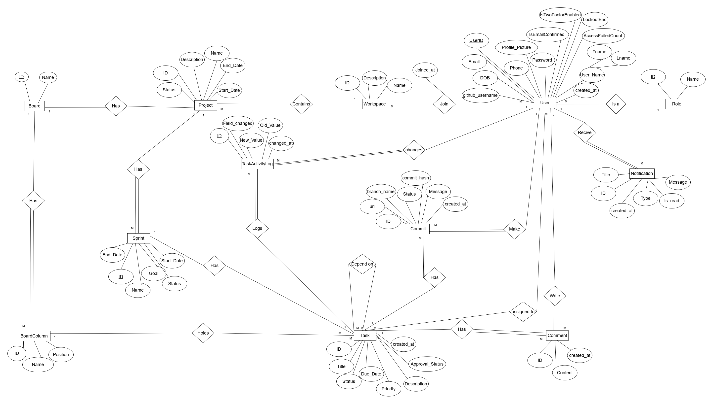
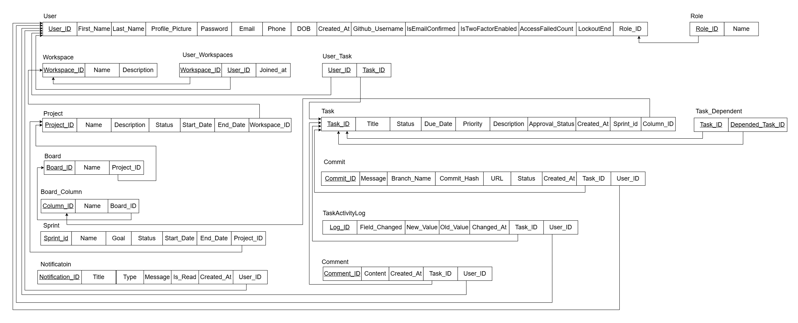
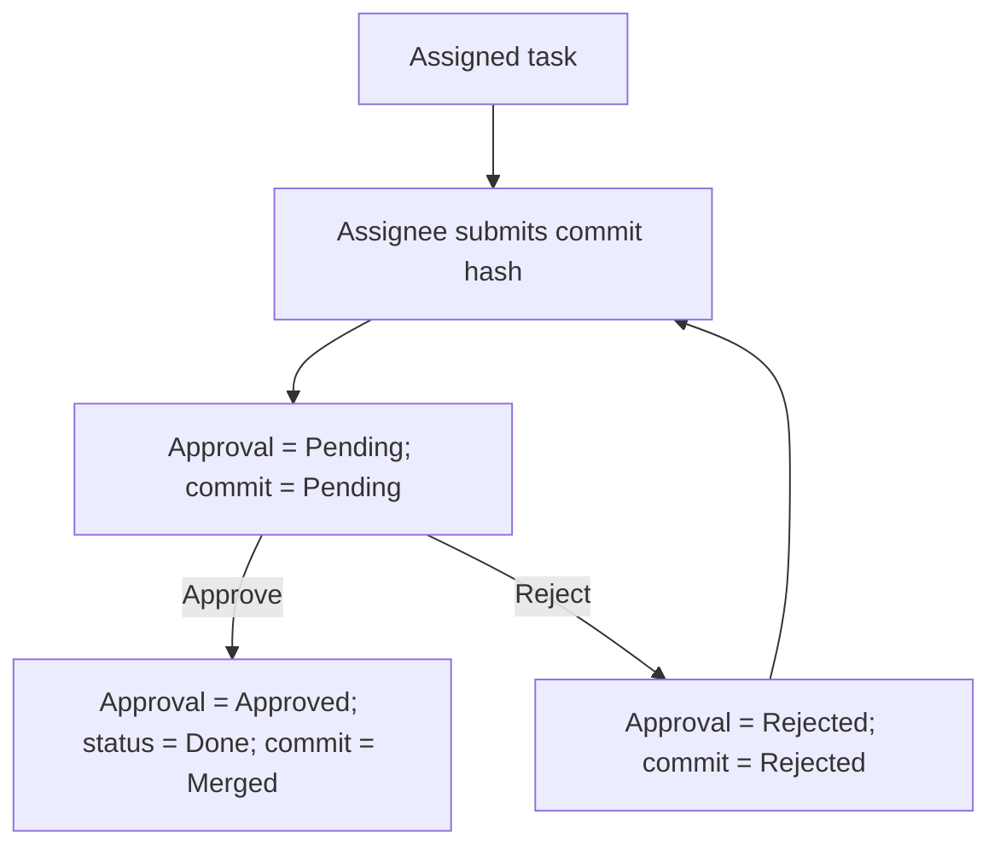
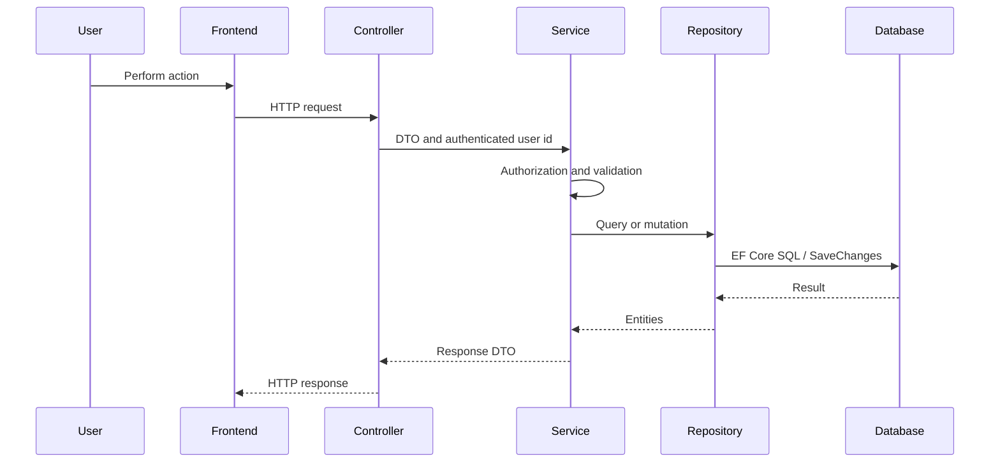

# AgileFlow Project Documentation

> Evidence basis: submitted AgileFlow repository snapshot
> Repository: [github.com/Bola-j/AgileFlow](https://github.com/Bola-j/AgileFlow)
> Reviewed: 16 July 2026

## Contents

1. [Project Planning and Management](#1-project-planning-and-management)
2. [Requirements](#2-requirements)
3. [System Analysis and Design](#3-system-analysis-and-design)
4. [Implementation](#4-implementation)
5. [Testing and Evidence](#5-testing-and-evidence)
6. [Current Limitations and Improvement Plan](#6-current-limitations-and-improvement-plan)
7. [User Manual and Presentation](#7-user-manual-and-presentation)

## Documentation Status Terms

| Term | Meaning |
| --- | --- |
| Implemented | The submitted repository snapshot contains the backend implementation. Frontend support is stated separately where relevant. |
| Partial | Some code or test scaffolding exists, but the feature is incomplete or has important gaps. |
| Not implemented | No complete implementation exists in the submitted repository snapshot. |

## 1. Project Planning and Management

### 1.1 Project Proposal

AgileFlow is a web application for small software teams that organize work through workspaces, projects, sprints, Kanban boards, and tasks.

The implemented product focuses on:

- authenticated user accounts;
- workspace-scoped roles;
- project and sprint planning;
- board and task management;
- task assignment and dependencies;
- commit-hash submission and review;
- task activity history;
- dashboard summaries;
- email-confirmation and workflow email attempts.

The application uses a .NET 8 API, a React 19 frontend, and SQL Server.

### 1.2 Scope Status

| Area | Status | Repository evidence |
| --- | --- | --- |
| Registration and email confirmation | Implemented | Registration creates the account, attempts verification email, and returns no tokens. |
| Login, refresh, and logout | Implemented | Confirmed users receive JWT and refresh tokens; refresh rotates tokens; logout revokes the supplied token. |
| Account profile | Implemented | Users can read/update profile data and upload a profile image. |
| Workspaces | Implemented | Authenticated users create workspaces and become Admin. |
| Membership | Implemented | Admins add/restore members, update roles, remove members, and read member details. |
| Projects | Implemented | Admin and TeamLead can create, read, update, and soft-delete projects. |
| Sprints | Implemented | Admin and TeamLead can create, update, start, complete, and read progress. |
| Sprint cancellation | Not implemented | The enum contains `Cancelled`, but no cancellation endpoint exists. |
| Boards | Implemented | Project creation attempts to create one board with three default columns. |
| Board columns | Implemented with gaps | Managers add, rename, delete, and reorder columns; validation is incomplete. |
| Tasks | Implemented | Managers create, move, assign, change status, and delete. Managers and assignees can edit fields. |
| Dependencies | Implemented | The service rejects self, duplicate, cross-project, and circular dependencies. |
| Submit/review | Implemented with gaps | Assignees submit a commit hash; managers approve/reject with comments. Some transitions allow inconsistent states. |
| Activity history | Implemented with gaps | Several task changes are logged, but assignment/deletion are not and text lengths conflict. |
| Dashboard | Implemented | Summary and current-user task endpoints are used by the React frontend. |
| Workflow email | Implemented with gaps | Email and audit writes are attempted; failures are non-fatal and retry is absent. |
| In-app notifications | Partial model only | `Notification` entity and configuration exist, but there is no controller/service/UI workflow. |
| Task comments | Review-only | Comments are created during review; there is no general discussion API. |
| Git provider integration | Not implemented | Commit hashes are stored without GitHub verification, URL, branch, or webhook integration. |
| OAuth | Assigned but not implemented | Google/GitHub third-party authentication is assigned to Moataz Hamdy (`M3tazz`); the submitted snapshot does not yet contain the merged implementation. |
| Automatic task assignment | Not implemented | No assignment engine or recommendation logic exists. |
| Production deployment | Not implemented | Local source and development Docker execution exist; no production deployment is defined. |

### 1.3 System Roles

Roles are stored on `UserWorkspace`, so a user can hold a different role in each workspace.

| Capability | Admin | TeamLead | Developer |
| --- | :---: | :---: | :---: |
| Read workspace-owned data | Yes | Yes | Yes |
| Update/delete workspace | Yes | Yes | No |
| Add/restore/remove members | Yes | No | No |
| Change member roles | Yes | No | No |
| Read member detail | Yes | Yes | Yes |
| Create/update/delete projects | Yes | Yes | No |
| Create/update/start/complete sprints | Yes | Yes | No |
| Manage board columns | Yes | Yes | No |
| Create/delete tasks | Yes | Yes | No |
| Move tasks or directly change status | Yes | Yes | No |
| Assign/unassign users | Yes | Yes | No |
| Add/remove dependencies | Yes | Yes | No |
| Edit task fields | Yes | Yes | Only when assigned |
| Submit a task | Only when assigned | Only when assigned | Only when assigned |
| Review a submission | Yes | Yes | No |
| Read task activity | Yes | Yes | Yes |

Important details:

- Any authenticated user can create a workspace.
- The workspace creator becomes Admin.
- TeamLead can update or delete a workspace but cannot manage membership.
- The creator cannot be removed or demoted from Admin.
- The caller cannot remove themselves.
- The final Admin/TeamLead cannot be removed or demoted to Developer.

### 1.4 Team Contributions

The contribution summary distinguishes repository evidence from team-assigned responsibility.

| Contributor | Contribution basis | Responsibility |
| --- | --- | --- |
| Bola Ghaly | Areas visible in Git history | Initial setup, JWT, sprint/task services, workspace authorization, React frontend, CI, Postman, integration, and documentation |
| Fatma Elkassaby | Areas visible in Git history | Entities and configurations, membership, board workflow, task dependencies, and activity logs |
| Youssef-Amer17 / Youssef Amer | Areas visible in Git history | Initial frontend, authentication/profile, email verification, and notification audit |
| Yahia Hany | Areas visible in Git history | Workspace and project backend |
| Moataz Hamdy (`M3tazz`) | Team-assigned responsibility | Google/GitHub third-party authentication; planned and not merged in the submitted repository snapshot |

The first four summaries are based on repository history and commit subjects. Moataz's OAuth responsibility is recorded from the team's assignment and is presented transparently as planned work.

### 1.5 Risks

| Risk | Current evidence | Mitigation |
| --- | --- | --- |
| Documentation overstates incomplete features | Model-only notifications and commit storage can be mistaken for full features. | Keep status terms explicit. |
| Authorization inconsistency | Board filtering is narrower than other task reads. | Apply one task-visibility rule to every read endpoint. |
| Partial database writes | Repositories save several times during one use case. | Use explicit transactions or one unit-of-work commit. |
| Concurrency races | Active sprint and board-column limits use check-then-write logic. | Add database constraints or transaction isolation. |
| Email loss | Email and audit persistence can both fail; no retry worker exists. | Add an outbox and retry queue. |
| Weak automated tests | Only one placeholder xUnit test exists. | Add service and integration tests. |
| Local file storage | Profile images are written to API disk. | Use object storage for deployed environments. |
| Mutable column semantics | Column name controls logical task status. | Store an immutable mapped status/type. |

## 2. Requirements

### 2.1 Stakeholders

| Stakeholder | Need |
| --- | --- |
| Workspace Admin | Membership administration and delivery management |
| Workspace TeamLead | Delivery management without membership administration |
| Workspace Developer | Relevant task access, assigned-task editing, and submission |
| Project team | Stable setup, clear contracts, and accurate documentation |
| Evaluator | Demonstrable behavior and honest evidence of limitations |

### 2.2 Implemented User Stories

- As a user, I can register and confirm my email.
- As a confirmed user, I can log in, refresh my session, and log out.
- As a user, I can update my account profile.
- As an authenticated user, I can create a workspace.
- As an Admin, I can manage workspace membership.
- As an Admin or TeamLead, I can manage projects and sprints.
- As an Admin or TeamLead, I can configure a project board.
- As an Admin or TeamLead, I can create, assign, move, and delete tasks.
- As an assigned user, I can edit task fields and submit a commit hash.
- As an Admin or TeamLead, I can review submitted work.
- As an Admin or TeamLead, I can manage task dependencies.
- As a workspace member, I can read task activity logs.
- As a user, I can view dashboard data from my workspaces.

### 2.3 Functional Requirements

#### Authentication

- Create an Identity user with a unique email.
- Enforce configured password rules.
- Generate an email-confirmation token.
- Block login before confirmation.
- Issue HMAC SHA-256 JWT access tokens.
- Generate random seven-day refresh tokens.
- Rotate refresh tokens.
- Revoke a refresh token during logout.

#### Workspace and Membership

- Create/list/read/update/delete workspaces.
- Store roles per workspace.
- Add or restore an existing registered user.
- Update a member role.
- Soft-remove membership.
- Protect creator and final-manager membership.

#### Delivery Workflow

- Create/update/delete projects.
- Automatically create a project board and default columns.
- Create/update/start/complete sprints.
- Calculate sprint progress.
- Create/update/move/assign/delete tasks.
- Submit task work with a commit hash.
- Approve/reject with a required comment.
- Add/remove valid task dependencies.
- Record task activity.

#### Notifications

- Attempt verification email.
- Attempt workspace invitation email.
- Attempt assignment email.
- Attempt submission/review email.
- Attempt due reminder email.
- Attempt to store success/failure email audit records.

### 2.4 Non-Functional Requirements

| Requirement | Current implementation |
| --- | --- |
| Authentication | ASP.NET Identity and JWT Bearer |
| Authorization | Service-level workspace membership and role checks |
| Persistence | SQL Server and EF Core migrations |
| Error handling | Central exception middleware plus automatic model validation |
| Maintainability | Onion Architecture project structure and repository/service interfaces |
| Frontend usability | React routes for all main application areas |
| Local deployability | Source execution and Docker Compose |
| Testability | Postman collection, two Playwright scenarios, placeholder xUnit project |

## 3. System Analysis and Design

### 3.1 Onion Architecture

AgileFlow uses Onion Architecture with the Repository Pattern.



Project reference direction:

- API references Application and Infrastructure.
- Infrastructure references Application and Domain.
- Application references Domain.
- Domain references the ASP.NET Identity EF package.

Current deviations:

- Domain contains a framework-coupled `AppUser : IdentityUser`.
- Use-case services are implemented in Infrastructure.
- API composes Infrastructure directly.
- Repositories save independently.

### 3.2 Backend Inventory

| Item | Count |
| --- | ---: |
| API controllers | 8 |
| Controller actions | 52 |
| Domain entities | 16 |
| Domain enums | 10 |
| Infrastructure services | 13 |
| Repositories | 8 |
| EF configurations | 16 |
| EF migrations | 7 |

### 3.3 Domain Model



#### Entity Relationship Diagram



*Figure 1. Entity relationship diagram for the AgileFlow domain model.*

#### Relational Schema



*Figure 2. Relational schema for the AgileFlow domain model.*

Main entities:

| Entity | Purpose |
| --- | --- |
| `AppUser` | Identity user and profile |
| `RefreshToken` | Persisted refresh token |
| `Workspace` | Collaboration container |
| `UserWorkspace` | Membership and workspace role |
| `Project` | Workspace project |
| `Board` | One board per project |
| `BoardColumn` | Ordered workflow column |
| `Sprint` | Project iteration |
| `ProjectTask` | Task state and dates |
| `UserTask` | Task assignment |
| `TaskDependent` | Directed dependency edge |
| `Commit` | Submitted commit hash and review result |
| `Comment` | Review comment |
| `TaskActivityLog` | Task change record |
| `Notification` | Persisted model without an application workflow |
| `EmailNotificationLog` | Email outcome and deduplication record |

### 3.4 Task State

Task status:

- `Todo`
- `InProgress`
- `Done`
- `Cancelled`

Approval status:

- `null`
- `Pending`
- `Approved`
- `Rejected`

Commit status:

- `Pending`
- `Merged`
- `Rejected`



There is no `PendingReview` task status. Pending review is stored in `ApprovalStatus`.

### 3.5 Core Service Checks

- Project end date must be after start date.
- A project end-date reduction cannot precede existing sprint end dates or task due dates.
- Sprint dates must remain inside project dates.
- Task due dates must remain inside sprint and project dates.
- The service normally allows one active sprint per project.
- Sprint completion requires all loaded tasks to be Done and Approved.
- Task creation in a Done-mapped column is rejected.
- Direct transition to Done requires Approved.
- Submit, approval, and movement to Done require dependencies to be Done and Approved.
- Dependencies must be in the same project.
- Self, duplicate, and circular dependencies are rejected.
- Review requires Approved or Rejected plus a non-empty comment.

These are application checks, not universal database guarantees.

### 3.6 Data Flow



## 4. Implementation

### 4.1 Technology Stack

| Area | Technology |
| --- | --- |
| Backend | ASP.NET Core Web API, .NET 8 |
| Identity | ASP.NET Core Identity |
| Authentication | JWT Bearer |
| Database | SQL Server |
| ORM | Entity Framework Core 8 |
| Mapping | AutoMapper |
| Email | MailKit and MimeKit |
| API documentation | Swagger/OpenAPI |
| Frontend | React 19, TypeScript, Vite 6 |
| Frontend state/data | TanStack Query and Axios |
| Forms | React Hook Form and Zod |
| UI | Tailwind, Radix UI, dnd-kit, Recharts |
| API workflow tests | Postman and Newman |
| Browser tests | Playwright |

### 4.2 Frontend Routes

- `/login`
- `/register`
- `/verify-email`
- `/`
- `/workspaces`
- `/workspaces/:workspaceId`
- `/workspaces/:workspaceId/projects`
- `/projects/:projectId`
- `/projects/:projectId/board`
- `/sprints/:sprintId`
- `/tasks`
- `/account`

The `/settings` route redirects to `/account`.

### 4.3 API Areas

| Area | Main routes |
| --- | --- |
| Auth | `/api/auth/register`, `/login`, `/confirm-email`, `/resend-confirmation`, `/refresh`, `/logout` |
| Account | `/api/account/me`, `/api/account/me/profile-picture` |
| Workspaces | `/api/Workspaces` and member subroutes |
| Projects | `/api/Projects` |
| Sprints | `/api/projects/{projectId}/sprints`, `/api/sprints/{id}` |
| Board | `/api/projects/{projectId}/board`, column routes |
| Tasks | sprint task routes, task detail/move/status/assignment/review/dependency/activity |
| Dashboard | `/api/dashboard/summary`, `/api/dashboard/my-tasks` |

Swagger is enabled in Development and mounted at the API root. Its current displayed title is `SolKey API v1`.

### 4.4 Error Mapping

| Exception | Status |
| --- | ---: |
| `KeyNotFoundException` | 404 |
| `EmailNotVerifiedException` | 403 |
| `UnauthorizedAccessException` | 403 |
| `ArgumentException` | 400 |
| `InvalidOperationException` | 409 |
| `SecurityTokenException` | 401 |
| Other exception | 500 |

Invalid credentials also use `UnauthorizedAccessException`, so they are returned as 403 rather than 401.

Automatic model validation returns ASP.NET validation problem details, while middleware returns `{ "message": "..." }`. The error contract is therefore not uniform.

### 4.5 Local Execution

Run the API:

```powershell
dotnet run --project backend/API/API.csproj
```

Run the frontend:

```powershell
cd frontend
npm install
npm run dev
```

Development defaults:

- API: `http://localhost:6358`
- frontend: `http://127.0.0.1:5173`
- database: `AgileFlow_Development` on `Server=localhost`
- SMTP: `localhost:2525`

### 4.6 Docker Execution

```powershell
docker compose up --build
```

Services:

- SQL Server 2022;
- API on port `6358`;
- frontend on port `5173`.

The Compose configuration runs the API in Development and does not include SMTP.

## 5. Testing and Evidence

### 5.1 Test Assets

| Asset | Current state |
| --- | --- |
| Postman | 105 requests and 157 static `pm.test(...)` definitions |
| Playwright | Two scenarios: registration verification state and authenticated profile editing |
| xUnit | One placeholder `Assert.True(true)` test |
| CI | Restores and builds `backend/AgileFlow.slnx` only |

The xUnit project is not included in the solution used by CI.

### 5.2 Verification Commands

```powershell
dotnet build backend/AgileFlow.slnx -c Release
dotnet test backend/Tests/Tests.csproj -c Release

cd frontend
npm run lint -- --format stylish
npm run build
cd ..

npm run postman:test
npm run e2e
```

### 5.3 Verification Snapshot

On 16 July 2026:

- backend solution build passed with 0 errors;
- backend build reported one `NU1902` MailKit vulnerability warning;
- separate xUnit project passed one placeholder test;
- frontend lint passed;
- frontend production build passed with a large-chunk warning;
- Newman was not run;
- Playwright was not run.

### 5.4 Required Test Scenarios

- registration with valid and duplicate email;
- login before/after confirmation;
- refresh rotation and logout;
- workspace creator role;
- TeamLead membership-management rejection;
- Developer project/task-management rejection;
- project/sprint/task date bounds;
- second active sprint rejection;
- empty-sprint completion behavior;
- board column count and reorder validation;
- Developer board visibility versus other task reads;
- assigned/unassigned task editing;
- submit/review state transitions;
- resubmission of Done/Approved tasks;
- Pending task movement;
- direct and indirect dependency cycles;
- dependency regression;
- long description/review activity-log behavior;
- cancelled-task due reminder;
- soft-deleted parent access;
- invalid numeric enum values;
- confirmation response disclosure;

## 6. Current Limitations and Improvement Plan

| Area | Current limitation or improvement need |
| --- | --- |
| Onion boundaries | Domain depends on Identity; use-case services are in Infrastructure; API references Infrastructure. |
| Transactions | Project/task workflows can partially persist because repositories save independently. |
| CI/tests | CI does not compile or run the separate placeholder test project. |
| Login lockout | Lockout options are configured, but login uses `CheckPasswordAsync` without the lockout workflow. |
| Refresh tokens | Stored in plaintext; refresh validation disables audience validation. |
| Logout | Supplied refresh token is not checked against the authenticated caller. |
| JWT role | Highest role is selected across non-deleted membership rows, not the target workspace. |
| Confirmation disclosure | Existing and unknown user ids produce different email fields. |
| Member privacy | Any workspace member can read another member's detailed profile response. |
| Soft deletion | Deleting a workspace/project does not consistently make child resources inaccessible through every path. |
| Board limit | Column check uses `count == 4`, has no database constraint, and can race. |
| Board reorder | Duplicate or incomplete column-id lists are not rejected. |
| Board sprint | Board retrieval does not validate that the requested sprint belongs to the project. |
| Status mapping | Column display names determine task status. |
| Review movement | Moving a Pending task can clear approval while leaving a Pending commit. |
| Resubmission | A Done/Approved task can be submitted again. |
| Dependency regression | Reopened dependencies do not reopen completed dependent tasks. |
| Activity log length | Log values allow 500 characters; descriptions/comments allow 2,000. |
| Enum validation | Undefined numeric roles/statuses/priorities are not consistently rejected. |
| Sprint lifecycle | Already Active start is accepted; empty Active sprint can complete; no cancel endpoint exists. |
| Due reminders | Cancelled tasks and inactive parent workflows are not explicitly excluded. |
| Email | No durable retry/outbox; HTML content is interpolated without explicit encoding. |
| Images | Local disk storage, no signature validation, no cleanup, and static files precede HTTPS redirection. |
| Docker | Development environment exposes Swagger and development confirmation endpoint. |
| Swagger | UI title is stale. |

## 7. User Manual and Presentation

### 7.1 User Manual

1. Start SQL Server, API, frontend, and optionally SMTP.
2. Register all user accounts.
3. Confirm their email addresses.
4. Log in with the account that will create the workspace.
5. Create a workspace.
6. Use the Admin account to add already-registered TeamLead and Developer users to the workspace.
7. Create a project.
8. Create and start a sprint.
9. Open the board.
10. Create and assign tasks.
11. Add valid dependencies.
12. Let assigned users edit and submit tasks.
13. Approve or reject submissions.
14. Inspect activity logs and dashboard data.
15. Complete the sprint after its tasks satisfy the implemented checks.

### 7.2 Recommended Demo

1. Show the Onion Architecture project structure.
2. Register and confirm an account.
3. Log in and create a workspace.
4. Demonstrate Admin-only member management.
5. Demonstrate TeamLead delivery permissions.
6. Demonstrate Developer restrictions.
7. Create project, sprint, board, and tasks.
8. Demonstrate date validation.
9. Demonstrate dependency rejection.
10. Submit and review a task.
11. Show activity logs and sprint progress.
12. Show test assets and state exactly what was and was not executed.
13. Finish with the current limitations and improvement plan.

### 7.3 Final Scope Statement

The submitted AgileFlow snapshot implements the central workflow for authenticated, workspace-based Agile planning and task review. Google/GitHub third-party authentication is assigned to Moataz Hamdy (`M3tazz`) and remains planned/unmerged in this snapshot. Automatic Git verification, general discussion threads, a complete in-app notification feature, automatic task assignment, deep backend test coverage, and production deployment remain future improvements.
