# AgileFlow Project Documentation

All documents should be uploaded to GitHub.

# 1. Project Planning & Management

## 1.1 Project Proposal

This document strictly follows the required project documentation structure shown in the reference images. It describes the AgileFlow MVP as currently implemented in the GitHub repository `Bola-j/AgileFlow`.

AgileFlow is a lightweight Agile project and task management system inspired by Jira. It helps small software teams organize workspaces, projects, sprints, boards, tasks, dependencies, members, and role-based collaboration.

The project was proposed as a simplified but extensible task distribution system for graduation project work. The long-term product vision includes automated task assignment, targeted notifications, and version-control integration, but the MVP prioritizes a working core workflow that can be demonstrated and extended.

Features such as automated task distribution, full GitHub webhook synchronization, in-app notification center, and full task discussion threads are treated as future upgrades unless explicitly implemented in the current source code. Email verification, workflow email notifications, task review decisions, dashboard summaries, and commit submission/review are part of the current repository state.

## 1.2 Project Plan

The original plan was organized around these delivery areas:

Final submission deadline: Thursday, 16/7/2026.

| Phase | Planned Scope | Current MVP Status |
| --- | --- | --- |
| Backend setup | .NET layered backend and database | Implemented |
| Authentication | Register, login, refresh token, logout | Implemented |
| Workspace and roles | Workspace CRUD and scoped member roles | Implemented |
| Project management | Project CRUD under workspaces | Implemented |
| Sprint management | Sprint CRUD, start, complete, progress | Implemented |
| Board management | Project board and board columns | Implemented |
| Task management | Task CRUD, movement, assignment, status | Implemented |
| Dependencies | Same-project task dependencies and cycle prevention | Implemented |
| Activity logs | Track task changes | Implemented |
| Email verification and notifications | Confirmation email, workspace/task/review/due-date emails, audit logs | Implemented |
| Comments/review feedback | Review decision comments for submitted task commits | Implemented for review flow |
| Version-control workflow | Commit hash submission and approval/rejection lifecycle | Implemented as internal workflow |
| Frontend | React 19 + TypeScript + Vite dashboard application | Implemented |
| Testing | Postman/Newman API suite, Playwright E2E, backend build pipeline | Implemented/ongoing |

## 1.3 Task Assignment & Roles

The system supports workspace-scoped roles:

| Role | Current Responsibility |
| --- | --- |
| Admin | Creates workspaces, manages members and roles, and can perform delivery management operations. |
| TeamLead | Manages project delivery workflow inside assigned workspaces, including projects, sprints, boards, tasks, dependencies, and review decisions. |
| Developer | Participates in workspace/project execution and works on assigned or visible tasks. |

The implementation uses a `UserWorkspace` join entity, so the same user can hold different roles in different workspaces.

Project team roles were tailored from GitHub history, commit subjects, Git identities, and the provided official names:

| Team Member | Git Identity Seen in History | Assigned Project Role | Responsibilities / Evidence |
| --- | --- | --- | --- |
| Bola Gerges Saeed Ghaly | `Bola Ghaly <bolagerges221@gmail.com>` | Team Leader, full-stack integration lead, backend workflow owner | Highest commit volume; repository setup, layered solution structure, JWT/auth work, sprint/task services, workspace authorization, React frontend implementation, dashboard, Postman workflow coverage, Playwright/E2E setup, CI fixes, merges, and final documentation/integration work. |
| Fatma Mahmoud Abdelkader Elkassaby | `Fatma Elkassaby <fatemamahmoud2004@gmailcom>` | Backend domain and board/task workflow engineer | Initial domain entities, enums, EF configurations, workspace membership, board and column management, task dependencies, activity logging, and sprint-scoped board workflow. |
| Youssef Amer Sayed Mostafa | `Youssef Amer <yousefamer771@gmail.com>`, `Youssef-Amer17 <yousefamer771@gmail.com>` | Authentication, profile, email verification/notification, and early frontend flow engineer | Initial HTML/JavaScript screens, login/registration/profile flows, email verification, SMTP notifications, email audit log, and due-date reminder worker. |
| Yahia Hany Shaker Rezk | `Yahia Hany <yahyahany222@gmail.com>` | Workspace and project API contributor | Workspace and project backend slice including controllers, services, repositories, repository interfaces, DTOs, and AutoMapper profiles. |

## 1.4 Risk Assessment & Mitigation Plan

| Risk | Impact | Mitigation |
| --- | --- | --- |
| Scope creep from Jira-like feature expectations | MVP may become too large to finish | Separate implemented MVP from future upgrades. |
| Frontend and backend mismatch | Demo flows may fail from UI | Validate the final submitted frontend against the live API workflow. |
| Role/permission mistakes | Users may access unauthorized workspace data | Use workspace authorization service and include permission tests. |
| Database relationship complexity | EF migration or delete behavior errors | Keep explicit entity configurations and query filters. |
| Token/session bugs | Auth flow may fail in real use | Use JWT plus refresh tokens and test register/login/refresh/logout. |
| Dependency cycles | Task workflow can become invalid | Enforce no self-dependency, duplicates, cross-project dependencies, or cycles. |

## 1.5 Key Performance Indicators (KPIs)

Suggested KPIs for the MVP:

| KPI | Target |
| --- | --- |
| Authentication success rate | Users can register, login, refresh, and logout without manual DB edits. |
| Workspace setup completion | Admin can create a workspace and add members with roles. |
| Project workflow completion | Admin/TeamLead can create a project, sprint, board, and tasks. |
| Permission correctness | Developers are blocked from manager-only actions. |
| Task workflow reliability | Tasks can move between board columns and update status. |
| Dependency validation | Invalid dependency cases are rejected clearly. |
| API regression coverage | Newman collection passes against a local API instance. |

# 2. Literature Review

## 2.1 Feedback & Evaluation

AgileFlow follows common Agile project management concepts used in tools such as Jira, Trello, and Azure Boards:

- Workspaces group teams and projects.
- Projects contain sprints.
- Sprints contain tasks.
- Boards visualize workflow using columns.
- Tasks can be assigned to users and moved through statuses.
- Dependencies prevent invalid execution order.
- Activity logs improve traceability.

The MVP successfully captures the core workflow needed for a small Agile team, while avoiding enterprise-scale complexity.

## 2.2 Suggested Improvements

Future improvements should be applied after the MVP is stable:

| Improvement | Reason |
| --- | --- |
| Continue hardening frontend/API integration | Ensure the submitted React frontend remains fully functional during demo and grading. |
| Add full task discussion comments | Review comments exist, but a general threaded task discussion feature is still future scope. |
| Add in-app notification center | Email notifications exist, but a user-facing in-app notification inbox is still future scope. |
| Add automated task assignment | Original intelligent distribution goal. |
| Add GitHub webhook integration | Commit hash submission/review exists, but automatic GitHub webhook synchronization is still future scope. |
| Expand dashboard analytics | Current summary charts can be extended with velocity, cycle time, and member workload. |
| Add stronger backend unit/integration tests | Newman and Playwright cover workflows, while xUnit service-level coverage should be expanded. |

## 2.3 Final Grading Criteria

Suggested grading criteria:

| Area | Evaluation Criteria |
| --- | --- |
| Functionality | Auth, workspace, project, sprint, board, task, dependency, and activity flows work end to end through API. |
| Design | Clear layered architecture, domain entities, DTOs, repositories, and services. |
| Database | Correct entity relationships, migrations, query filters, and role/task mapping tables. |
| Security | JWT authentication, refresh tokens, role-based authorization, and scoped workspace permissions. |
| Testing | Postman/Newman suite demonstrates main API flows and permission checks. |
| Documentation | Setup, architecture, API, diagrams, and missing/future scope are clearly documented. |
| Demo readiness | Local setup can run the backend and demonstrate the MVP workflow. |

# 3. Requirements Gathering

## 3.1 Stakeholder Analysis

| Stakeholder | Interest |
| --- | --- |
| Project supervisor/evaluator | Needs a working, documented MVP with clear scope and evidence. |
| Admin | Creates workspaces, manages members, and oversees project structure. |
| TeamLead | Manages project execution, sprints, boards, and team tasks. |
| Developer | Views relevant work and updates assigned tasks. |
| Development team | Needs maintainable architecture and extensible code. |

## 3.2 User Stories & Use Cases

| User Story | MVP Status |
| --- | --- |
| As a user, I can register and login securely. | Implemented |
| As a user, I can refresh my session token and logout. | Implemented |
| As an Admin, I can create a workspace. | Implemented |
| As an Admin, I can add, remove, and manage workspace members. | Implemented |
| As an Admin or TeamLead, I can create and update projects. | Implemented |
| As an Admin or TeamLead, I can create, start, complete, and track sprints. | Implemented |
| As a team member, I can view a project board. | Implemented |
| As an Admin or TeamLead, I can manage board columns. | Implemented |
| As an Admin or TeamLead, I can create and assign tasks. | Implemented |
| As a developer, I can work with visible/assigned tasks according to permissions. | Implemented |
| As a manager, I can define task dependencies. | Implemented |
| As a user, I can see task activity history. | Implemented |
| As a developer, I can submit task work for review with commit information. | Implemented |
| As a manager, I can approve or reject submitted task work with a review comment. | Implemented |
| As a user, I can receive workflow email notifications. | Implemented |
| As a user, I can comment in a full task discussion thread. | Future upgrade |
| As a user, I can use an in-app notification inbox. | Future upgrade |
| As a manager, I can sync commits automatically from GitHub webhooks. | Future upgrade |

## 3.3 Functional Requirements

Implemented MVP requirements:

- Register users with profile information.
- Login users and issue JWT access tokens.
- Rotate refresh tokens.
- Logout and revoke refresh tokens.
- Get and update current account profile.
- Create, read, update, and delete workspaces.
- Add, restore, remove, and update workspace members.
- Assign workspace-scoped roles: Admin, TeamLead, Developer.
- Create, read, update, and delete projects.
- Create, read, update, start, complete, and track sprints.
- Fetch a project board for a selected sprint.
- Add, rename, delete, and reorder board columns.
- Create, read, update, move, assign, unassign, and delete tasks.
- Add and remove dependencies between tasks.
- Retrieve task activity logs.
- Submit assigned task work for review with commit details.
- Approve or reject submitted task work with review comments.
- Send email verification and workflow notification emails.
- Store email notification audit/deduplication records.
- Show dashboard summary data in the frontend.
- Apply authorization based on user membership and role.
- Return consistent error responses through centralized exception handling.

Future requirements:

- Automated task distribution.
- Full task discussion comments API and UI.
- In-app notification API and UI.
- GitHub webhook integration.
- Advanced analytics dashboard.

## 3.4 Non-Functional Requirements

| Requirement | MVP Handling |
| --- | --- |
| Security | ASP.NET Identity, JWT Bearer authentication, refresh tokens, role policies. |
| Maintainability | Layered backend with API, Application, Domain, and Infrastructure projects. |
| Data integrity | EF Core configurations, migrations, relationships, and query filters. |
| Usability | Fully functioning frontend submission for login, registration, profile, workspaces, projects, and sprint board. |
| Testability | Postman/Newman API suite, Playwright E2E workflows, CI build, and xUnit test project scaffold. |
| Extensibility | Domain and services support review commits, notification logs, and future collaboration workflows. |
| Deployment readiness | Local run instructions exist; packaged/public deployment is not currently documented. |

# 4. System Analysis & Design

## 4.1 Problem Statement & Objectives

Small Agile teams need a simple tool to coordinate project work without the complexity of full enterprise tools. AgileFlow aims to provide a focused system for workspace membership, project planning, sprint execution, board tracking, task assignment, and dependency-aware task progress.

Objectives:

- Provide secure user authentication.
- Organize users into role-based workspaces.
- Manage projects and sprints.
- Track tasks on Kanban-style boards.
- Support task assignment and dependencies.
- Provide traceability through activity logs.
- Keep the architecture extensible for automation, notifications, and GitHub integration.

### 4.1.1 Use Case Diagram & Descriptions

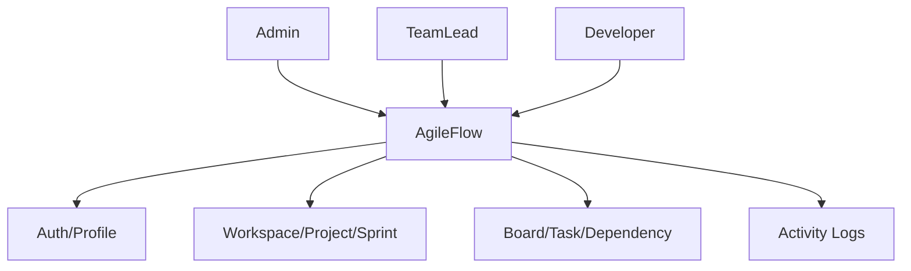

Use case descriptions:

| Use Case | Actors | Description |
| --- | --- | --- |
| Authenticate | All users | Register, login, refresh access token, logout. |
| Manage workspace | Admin, TeamLead | Create/update workspace; Admin manages member roles and membership. |
| Manage project | Admin, TeamLead | Create/update/delete projects inside a workspace. |
| Manage sprint | Admin, TeamLead | Create, update, start, complete, and inspect sprint progress. |
| Manage board | Admin, TeamLead | Configure columns and retrieve sprint board. |
| Work on task | Admin, TeamLead, Developer | Create, assign, move, update status, and view task details. |
| Manage dependencies | Admin, TeamLead | Add/remove valid dependencies between tasks. |
| Submit/review work | Developer, Admin, TeamLead | Submit task commits for review; managers approve or reject with comments. |
| Receive workflow emails | All users | Receive verification, workspace, assignment, review, and reminder emails. |
| View activity | Workspace members | Inspect changes made to a task. |

### 4.1.2 Functional & Non-Functional Requirements

See sections 3.3 and 3.4.

### 4.1.3 Software Architecture

AgileFlow uses a layered monolithic architecture:

| Layer | Responsibility |
| --- | --- |
| API | Controllers, middleware, Swagger, authentication setup, authorization pipeline. |
| Application | DTOs, service interfaces, repository interfaces, AutoMapper profiles. |
| Domain | Entities, enums, base entity model, business state fields. |
| Infrastructure | EF Core DbContext, migrations, entity configurations, repositories, services. |

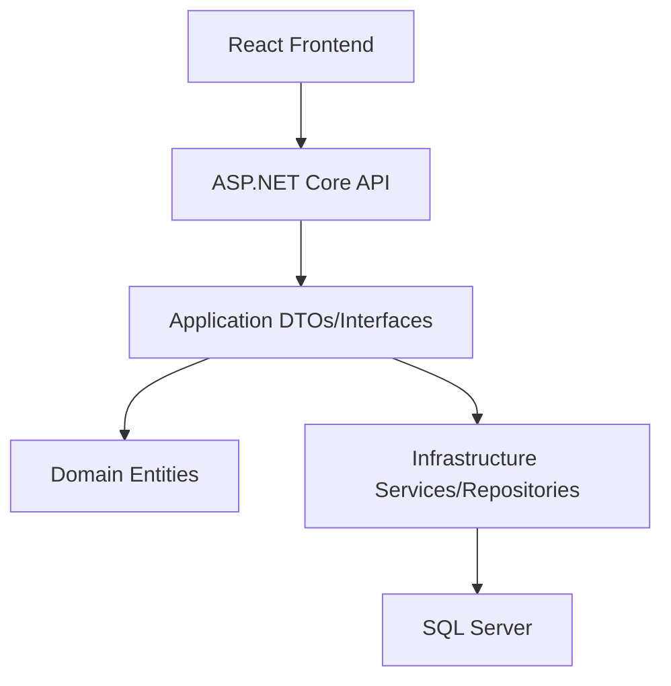

## 4.2 Database Design & Data Modeling

### 4.2.1 ER Diagram

The repository contains diagram assets at:

- `docs/Diagrams/ERD.png`
- `docs/Diagrams/Schema.png`

Core relationships:

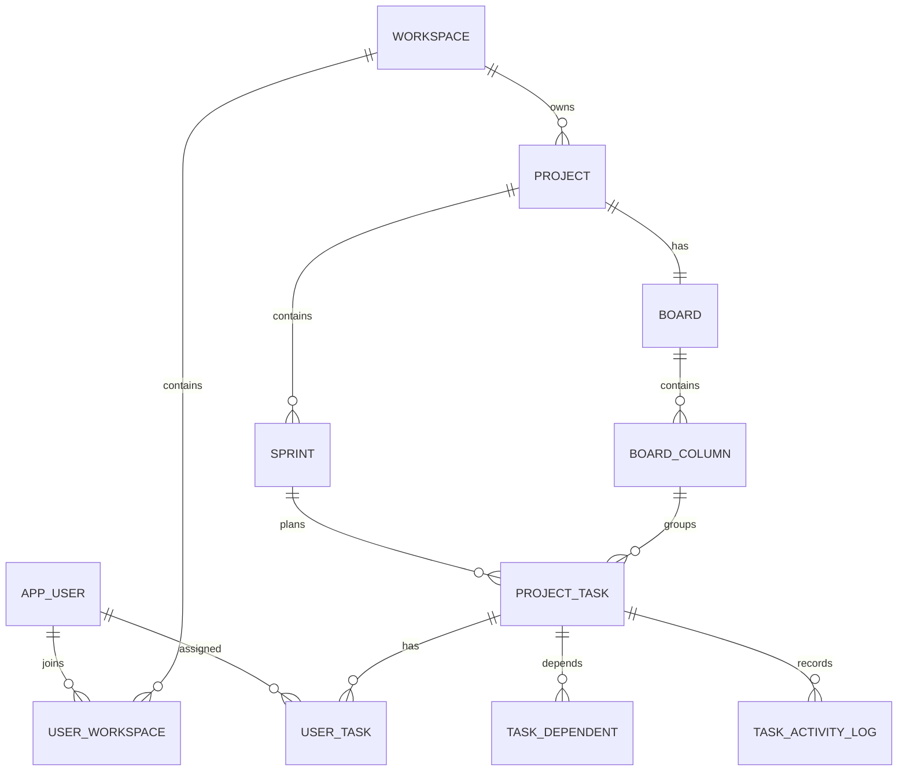

### 4.2.2 Logical & Physical Schema

Main logical entities:

| Entity | Purpose |
| --- | --- |
| AppUser | Identity user profile, GitHub username, deletion state. |
| RefreshToken | Rotated refresh-token records. |
| Workspace | Team/workspace container. |
| UserWorkspace | Membership and workspace role mapping. |
| Project | Project under a workspace. |
| Sprint | Time-boxed execution period under a project. |
| Board | One board per project. |
| BoardColumn | Ordered board workflow column. |
| ProjectTask | Sprint task with status, priority, due date, column, and assignments. |
| UserTask | Many-to-many assignment between users and tasks. |
| TaskDependent | Task dependency relation. |
| TaskActivityLog | Audit log for task mutations. |
| Commit | Submitted task commit data and review state. |
| EmailNotificationLog | Audited email notification send attempts and deduplication. |
| Comment | Future general task collaboration model; review comments are implemented in the task review flow. |
| Notification | Future in-app notification model. |

The physical schema is managed through EF Core migrations in `backend/Infrastructure/Migrations`.

## 4.3 Data Flow & System Behavior

### 4.3.1 Data Flow Diagram (DFD)

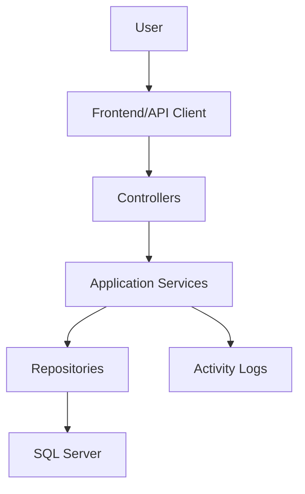

### 4.3.2 Sequence Diagrams

Task creation flow:

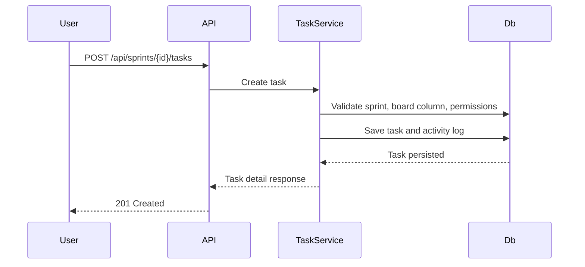

Task submit/review flow:

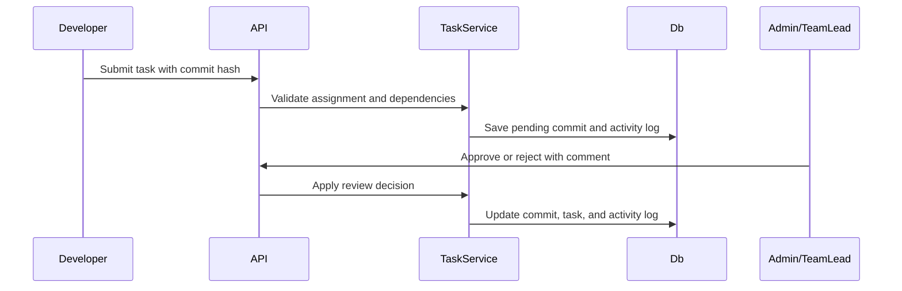

Dependency flow:

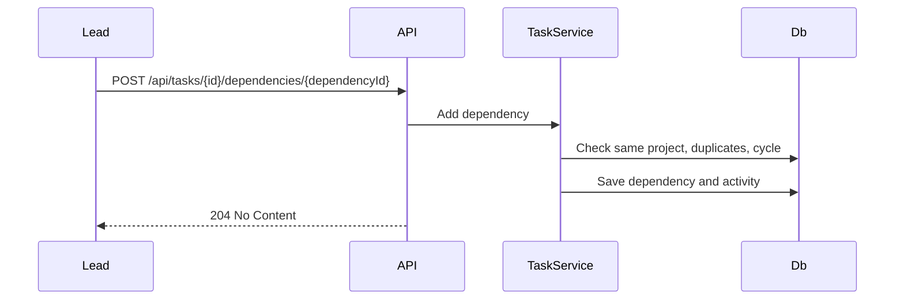

### 4.3.3 Activity Diagram

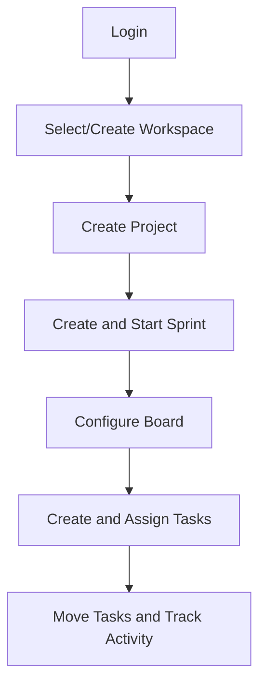

### 4.3.4 State Diagram

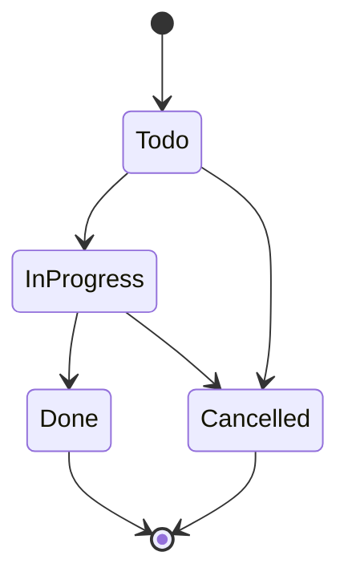

### 4.3.5 Class Diagram

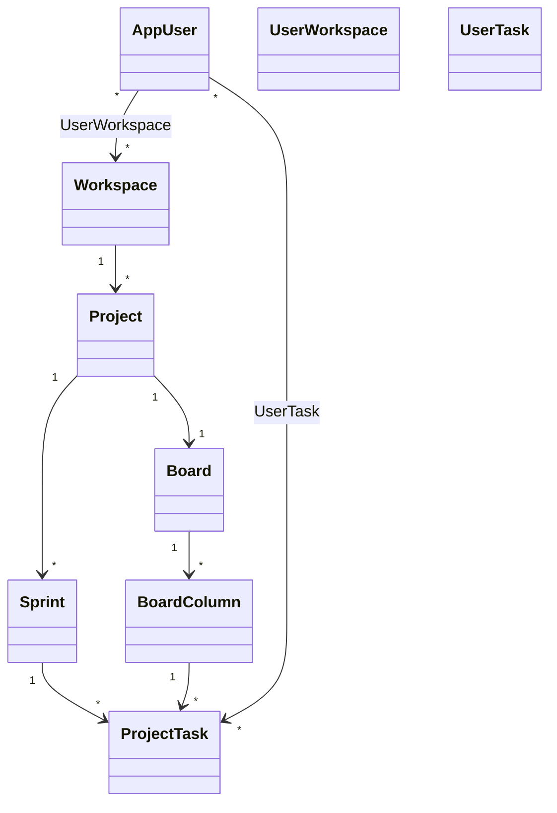

## 4.4 UI/UX Design & Prototyping

### 4.4.1 Wireframes & Mockups

Current frontend routes/pages:

| Page | Purpose | Current Data Source |
| --- | --- | --- |
| Login/Register/Verify Email | Authentication, email verification, resend confirmation | API-backed |
| Dashboard | Workspace/project/sprint/task summary and charts | API-backed |
| Account/Profile | Current-user profile and profile-picture upload | API-backed |
| Workspaces | Workspace list, create/open/delete based on role | API-backed |
| Workspace Details | Member list, role controls, add/remove members | API-backed |
| Projects | Project list and project forms under a workspace | API-backed |
| Sprint Details | Sprint progress, start/complete, embedded board | API-backed |
| Board/Tasks | Kanban columns, task cards, details, dependencies, review flow | API-backed |

### 4.4.2 UI/UX Guidelines

- Keep navigation simple: dashboard, workspace list, project details, sprint board, tasks, profile.
- Show controls based on the user's role.
- Keep board columns clear and ordered.
- Make task cards readable with title, status, and priority.
- Use clear success/error feedback from API responses.
- Avoid showing future features in the UI until their backend endpoints are implemented.

## 4.5 System Deployment & Integration

### 4.5.1 Technology Stack

| Area | Technology |
| --- | --- |
| Backend | ASP.NET Core Web API |
| Runtime | .NET 8 |
| Authentication | ASP.NET Identity, JWT Bearer, refresh tokens |
| Database | SQL Server |
| ORM | Entity Framework Core |
| Mapping | AutoMapper |
| API Docs | Swagger/OpenAPI |
| Frontend | React 19, TypeScript, Vite |
| Frontend Data/UI | TanStack Query, Axios, React Hook Form, Zod, Tailwind, dnd-kit, Recharts |
| API Testing | Postman/Newman |
| E2E Testing | Playwright |
| Unit Testing | xUnit project scaffold |
| CI | GitHub Actions restore/build |

### 4.5.2 Deployment Diagram

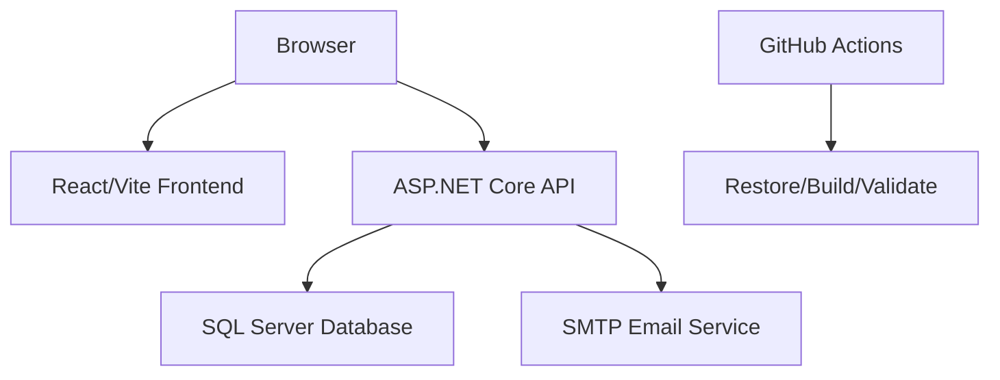

### 4.5.3 Component Diagram

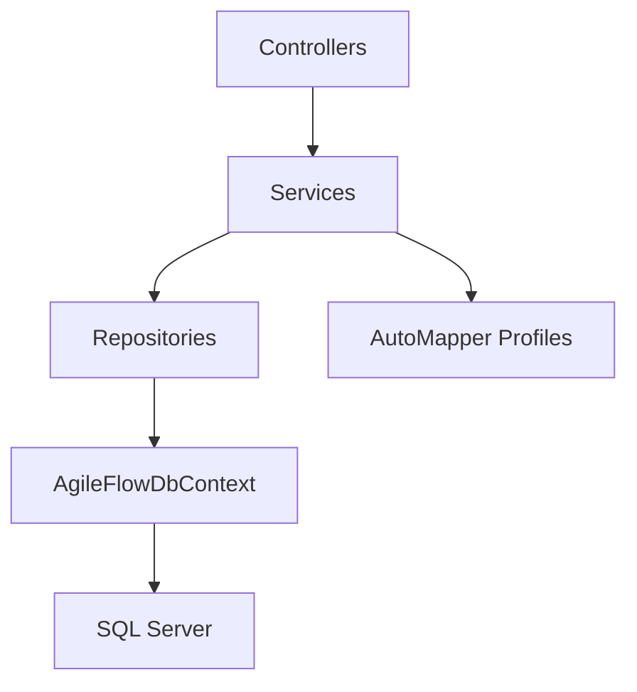

## 4.6 Additional Deliverables

### 4.6.1 API Documentation

Swagger is enabled in Development mode. The main API groups are:

| Area | Endpoints |
| --- | --- |
| Auth | `POST /api/auth/register`, `POST /api/auth/login`, `GET /api/auth/confirm-email`, `POST /api/auth/resend-confirmation`, `POST /api/auth/refresh`, `POST /api/auth/logout` |
| Account | `GET /api/account/me`, `PUT /api/account/me` |
| Workspaces | `GET/POST /api/Workspaces`, `GET/PUT/DELETE /api/Workspaces/{id}` |
| Workspace members | `POST /api/Workspaces/{workspaceId}/members`, role/profile/member detail endpoints |
| Projects | `GET /api/Projects/workspace/{workspaceId}`, `GET/PUT/DELETE /api/Projects/{id}`, `POST /api/Projects` |
| Sprints | `GET/POST /api/projects/{projectId}/sprints`, `GET/PUT /api/sprints/{id}`, start/complete/progress endpoints |
| Boards | `GET /api/projects/{projectId}/board?sprintId={id}`, column add/update/delete/order endpoints |
| Tasks | Sprint task list/create, task detail/update/status/move/assign/unassign/delete, submit/review endpoints |
| Dependencies | Add/remove dependencies between tasks |
| Activity logs | `GET /api/tasks/{id}/activity-logs` |

### 4.6.2 Testing & Validation

The repository includes:

- Postman collection: `postman/AgileFlow.postman_collection.json`
- Postman environment: `postman/AgileFlow.local.postman_environment.json`
- Newman scripts in root `package.json`
- xUnit test project: `backend/Tests`
- Playwright tests: `tests/e2e`

The Postman/Newman suite covers auth, account, workspaces, members, projects, sprints, boards, task CRUD, dependencies, activity logs, role permissions, scoped board visibility, and representative exception responses. Playwright covers browser-level workflow behavior against the frontend.

### 4.6.3 Deployment Strategy

Current local execution strategy:

1. Run SQL Server.
2. Configure the backend connection string and JWT settings.
3. Run the API using `dotnet run --project backend/API/API.csproj`.
4. Use Swagger or the Postman/Newman suite for API validation.
5. Start the React frontend from `frontend` using `npm install` then `npm run dev`.
6. Run Playwright E2E tests when browser workflow validation is required.

Public deployment and packaged executable delivery are not documented in the repository. The submitted project is intended to be executed from source for grading/demo.

# 5. Implementation (Source Code & Execution)

## 5.1 Source Code

### 5.1.1 Structured & Well-Commented Code

The backend is split into:

- `backend/API`
- `backend/Application`
- `backend/Domain`
- `backend/Infrastructure`
- `backend/Tests`

The code uses controllers for HTTP boundaries, services for business operations, repositories for persistence access, and EF Core configurations for database mapping.

### 5.1.2 Coding Standards & Naming Conventions

Observed conventions:

- C# classes use PascalCase.
- DTOs are grouped by feature.
- Controllers expose REST-like endpoints.
- Services and repositories use interface-driven dependency injection.
- Frontend feature modules are grouped by domain under `frontend/src/features`.
- Some backend namespace and file naming inconsistencies remain from earlier iterations and can be cleaned up after submission.

### 5.1.3 Modular Code & Reusability

Reusable modules include:

- Auth service and token service.
- Account service.
- Workspace authorization service.
- Workspace, project, sprint, task, and board services.
- Repository interfaces and implementations.
- AutoMapper profiles per feature.
- Centralized exception middleware.

### 5.1.4 Security & Error Handling

Security and error handling features:

- ASP.NET Identity password rules.
- JWT Bearer authentication.
- Refresh-token rotation and revocation.
- Workspace role authorization.
- Manager-only policies for Admin and TeamLead operations.
- Centralized exception handling middleware returning consistent `{ message }` responses.
- Soft-delete query filters on major entities.

## 5.2 Version Control & Collaboration

### 5.2.1 Version Control Repository

Repository: `Bola-j/AgileFlow`

### 5.2.2 Branching Strategy

Recent repository history shows feature branches merged through pull requests, including:

- `feature/project-workspace-api`
- `feature/task-flow`
- `feature/initial-setup`
- `feature/user-profile`

Suggested final strategy:

- `main`: stable submission branch.
- `feature/*`: isolated feature work.
- Pull request review before merging.
- CI build required before final merge.

### 5.2.3 Commit History & Documentation

Recent commits show incremental implementation of auth, profile, workspace members, sprint APIs, task APIs, board workflow, dependency/activity logs, exception handling, board visibility, email verification/notifications, React frontend implementation, Playwright coverage, and Postman validation.

### 5.2.4 CI/CD Integration

GitHub Actions currently restores and builds the backend solution on push and pull request to `main`.

Pipeline:

- Checkout repository.
- Setup .NET 8.
- Restore backend solution.
- Build backend solution in Release mode.

## 5.3 Deployment & Execution

### 5.3.1 README File

The README has been updated to describe the current project scope, architecture, local setup, frontend/backend commands, verification commands, and the team role table derived from repository history.

#### Installation Steps

1. Install .NET 8 SDK.
2. Install SQL Server.
3. Clone the repository.
4. Configure connection string and JWT settings.
5. Restore and build backend.
6. Run EF migrations automatically on API startup.
7. Install frontend dependencies.
8. Start backend and frontend.
9. Run Postman/Newman and Playwright tests.

#### System Requirements

- .NET 8 SDK
- SQL Server
- Node.js 20+ and npm for frontend, Newman, and Playwright
- Browser for Swagger and frontend execution
- Optional SMTP test inbox such as smtp4dev

#### Configuration Instructions

Configure:

- `ConnectionStrings:DefaultConnection`
- `Jwt:Issuer`
- `Jwt:Audience`
- `Jwt:Key`
- `Jwt:AccessTokenMinutes`
- `Jwt:RefreshTokenDays`
- SMTP/email settings under the email configuration section when testing verification emails.

#### Execution Guide

Backend:

```powershell
dotnet run --project backend/API/API.csproj
```

Frontend:

```powershell
cd frontend
npm install
npm run dev
```

Postman/Newman:

```powershell
npm install
npm run postman:test
```

Playwright:

```powershell
npm run e2e
```

#### API Documentation

Run the API in Development mode and open Swagger at the API root or `/swagger`.

#### Executable Files & Deployment Link

No packaged executable or public deployment link is currently documented.

#### Compiled or Packaged Application

Not currently packaged. The backend is executed from source.

#### Deployed Web or Mobile Application

No deployed web/mobile application link is documented in the repository; the frontend runs locally through Vite.

# 6. Testing & Quality Assurance

## 6.1 Test Cases & Test Plan

Main validation scenarios:

| Scenario | Expected Result |
| --- | --- |
| Register unique users | Returns registration response and requires email confirmation. |
| Confirm email | Account becomes eligible for login. |
| Login before confirmation | Returns forbidden response with email-confirmation flag. |
| Duplicate registration | Returns conflict response. |
| Login valid user | Returns access and refresh token. |
| Invalid login | Returns unauthorized/forbidden response. |
| Refresh token | Returns rotated token pair. |
| Create workspace | Creator becomes workspace Admin. |
| Add member | Member added with selected role. |
| Duplicate member | Conflict response. |
| Developer creates project | Forbidden. |
| Admin/TeamLead creates project | Project created. |
| Invalid project dates | Conflict response. |
| Create/start sprint | Sprint becomes active. |
| Start second active sprint | Conflict response. |
| Get board | Default columns are returned. |
| Developer mutates board | Forbidden. |
| Create/move/update task | Task response reflects changes. |
| Add invalid dependency | Rejected with clear response. |
| Add valid dependency | Dependency is stored. |
| Developer submits task work | Task enters pending review with commit data recorded. |
| Admin/TeamLead approves task | Commit/task review state updates and task can become done when rules are satisfied. |
| Admin/TeamLead rejects task | Rejection comment is stored and task remains available for correction. |
| Workflow email action occurs | Email send attempt is logged without rolling back the business action. |
| Read activity logs | Mutation history is returned. |

## 6.2 Automated Testing

Automated coverage:

- Newman/Postman holistic API validation suite.
- GitHub Actions backend build.
- Playwright E2E workflow coverage.
- xUnit test project exists and should be expanded with deeper service-level tests.

Recommended next step:

- Add real xUnit tests for workspace authorization, task permissions, dependency cycle detection, sprint lifecycle, refresh-token rotation, and board visibility.

## 6.3 Bug Reports

Known issues or gaps from repository review:

| Issue/GAP | Severity | Recommendation |
| --- | --- | --- |
| Frontend/API must remain aligned until demo | High | Run frontend build, Playwright, and core manual flows before submission. |
| SMTP/email settings may differ by machine | Medium | Document the SMTP test inbox values used during demo. |
| No public deployment link is documented | Medium | Provide one only if required by the evaluator; otherwise present local execution clearly. |
| xUnit tests need deeper service coverage | Medium | Add tests for authorization, task review, dependency cycle detection, sprint completion, and refresh-token rotation. |
| In-app notification center is not exposed | Medium | Keep it as a future upgrade while documenting current email notifications. |
| Full task discussion comments are not exposed | Low | Keep review comments implemented; add threaded discussions later. |
| Some namespace/file naming inconsistencies remain | Low | Clean them up in a post-submission refactor if time allows. |

# 7. Final Presentation & Reports

## 7.1 User Manual

Basic user flow:

1. Register an account.
2. Confirm the account email.
3. Login.
4. Create or open a workspace.
5. Add team members and assign roles.
6. Create a project.
7. Create and start a sprint.
8. Open the project board.
9. Create tasks in the sprint.
10. Assign tasks to users.
11. Add dependencies when one task depends on another.
12. Submit completed work for review with commit information.
13. Approve or reject submitted work.
14. Review task activity logs.

## 7.2 Technical Documentation

Technical documentation should include:

- Architecture overview.
- Database model.
- API endpoint list.
- Setup instructions.
- Testing guide.
- MVP/future-scope boundary.
- Known gaps and limitations.

This document can serve as the main technical documentation draft.

Final scope boundary:

- Database: SQL Server.
- Official grading rubric: the structure from the provided reference images is followed.
- Deployment link, demo video link, or packaged executable: not provided.
- Frontend submission status: fully functioning MVP frontend.
- Email verification, workflow email notifications, dashboard, and submit/review task workflow: implemented in the current repository.
- Automated task assignment, full GitHub webhook integration, in-app notification center, and threaded task comments: future upgrades.

## 7.3 Project Presentation

Suggested presentation structure:

1. Problem and motivation.
2. Original vision vs MVP scope.
3. User roles.
4. System architecture.
5. Database model.
6. Main API workflows.
7. Demo: auth, workspace, project, sprint, board, task, dependency.
8. Testing evidence.
9. Limitations and future upgrades.

## 7.4 Video Demonstration

Suggested demo script:

1. Start the backend locally.
2. Open Swagger or Postman.
3. Register/login users.
4. Create workspace and add Admin/TeamLead/Developer users.
5. Create a project.
6. Create and start a sprint.
7. Fetch the board and verify default columns.
8. Create tasks.
9. Assign tasks.
10. Move a task through the board.
11. Add a valid dependency.
12. Try an invalid dependency and show rejection.
13. Submit a task for review with commit details.
14. Approve or reject the submitted task.
15. Show activity logs.
16. Run Newman and/or Playwright test suite to show validation coverage.
